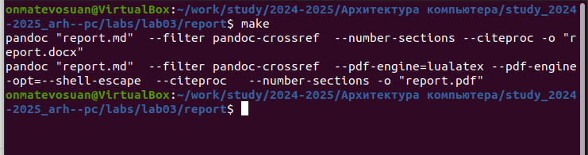
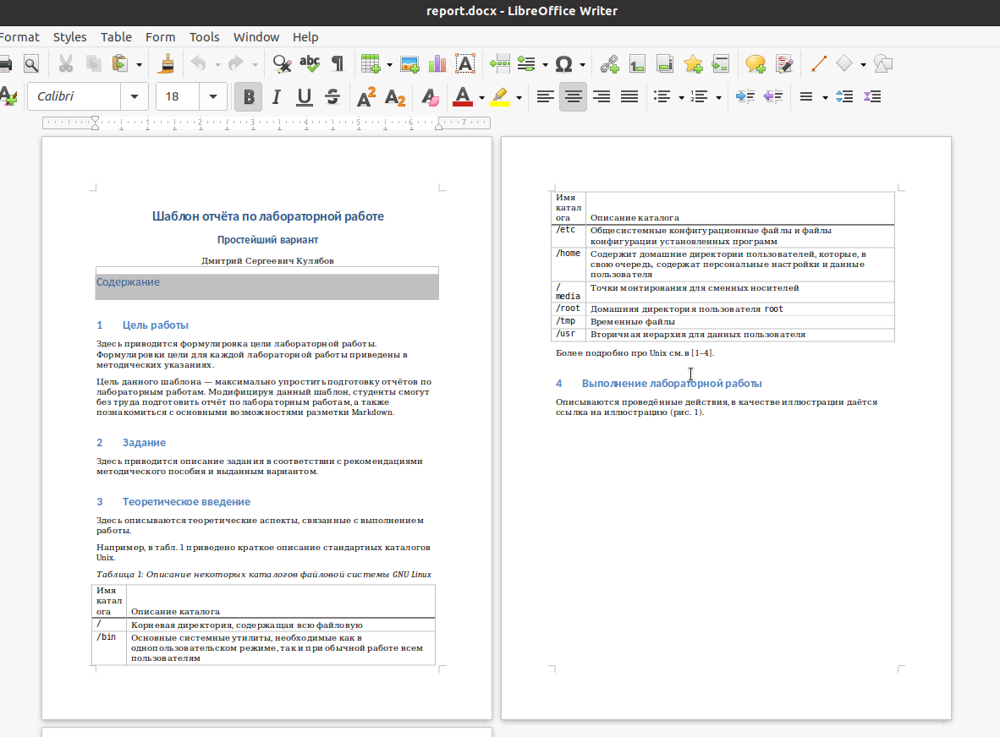
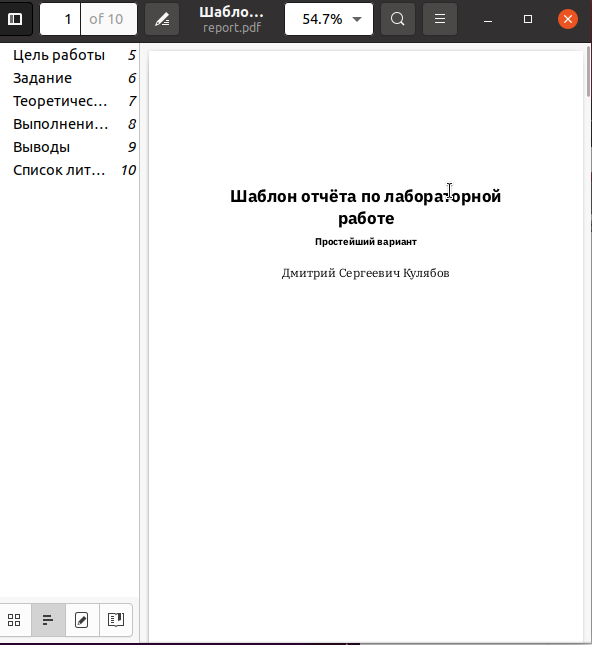
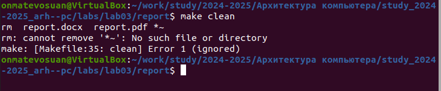
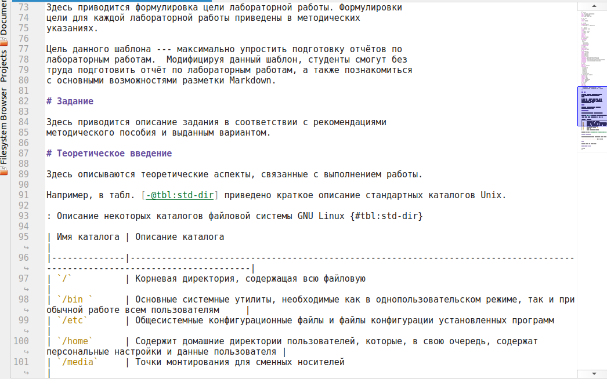
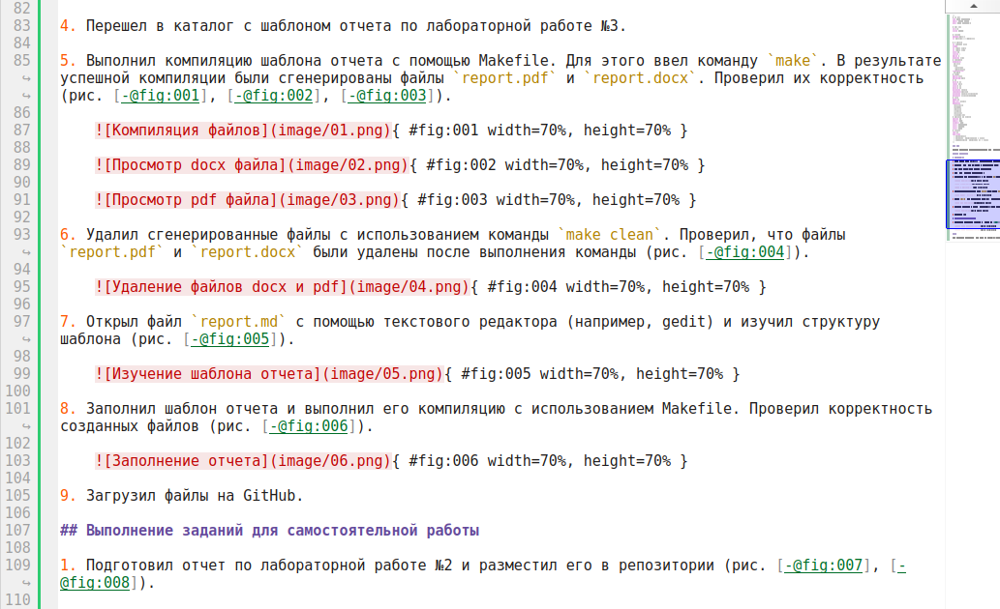
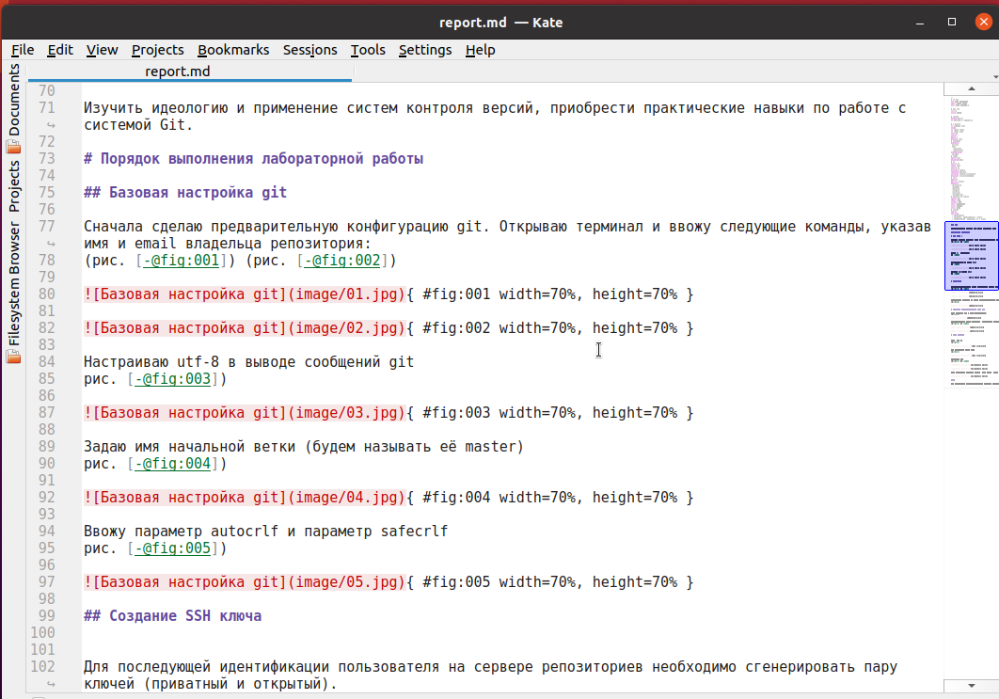
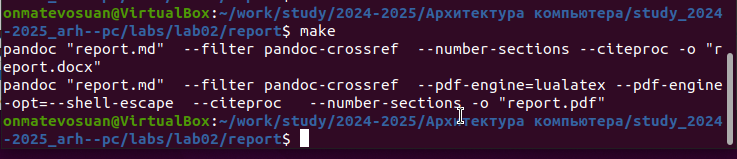

---
## Front matter
title: "Отчёт по лабораторной работе 3"
subtitle: "Архитектура компьютера"
author: "Матевосян Оганес НБИбд-03-24"

## Generic otions
lang: ru-RU
toc-title: "Содержание"

## Bibliography
bibliography: bib/cite.bib
csl: pandoc/csl/gost-r-7-0-5-2008-numeric.csl

## Pdf output format
toc: true # Table of contents
toc-depth: 2
lof: true # List of figures
lot: true # List of tables
fontsize: 12pt
linestretch: 1.5
papersize: a4
documentclass: scrreprt
## I18n polyglossia
polyglossia-lang:
  name: russian
  options:
	- spelling=modern
	- babelshorthands=true
polyglossia-otherlangs:
  name: english
## I18n babel
babel-lang: russian
babel-otherlangs: english
## Fonts
mainfont: PT Serif
romanfont: PT Serif
sansfont: PT Sans
monofont: PT Mono
mainfontoptions: Ligatures=TeX
romanfontoptions: Ligatures=TeX
sansfontoptions: Ligatures=TeX,Scale=MatchLowercase
monofontoptions: Scale=MatchLowercase,Scale=0.9
## Biblatex
biblatex: true
biblio-style: "gost-numeric"
biblatexoptions:
  - parentracker=true
  - backend=biber
  - hyperref=auto
  - language=auto
  - autolang=other*
  - citestyle=gost-numeric
## Pandoc-crossref LaTeX customization
figureTitle: "Рис."
tableTitle: "Таблица"
listingTitle: "Листинг"
lofTitle: "Список иллюстраций"
lotTitle: "Список таблиц"
lolTitle: "Листинги"
## Misc options
indent: true
header-includes:
  - \usepackage{indentfirst}
  - \usepackage{float} # keep figures where there are in the text
  - \floatplacement{figure}{H} # keep figures where there are in the text
---

# Цель работы

Целью данной лабораторной работы является освоение процедуры оформления отчетов с использованием легковесного языка разметки Markdown и автоматизация процесса генерации отчетов в различных форматах (PDF и DOCX) с помощью инструментов Makefile, Pandoc и TexLive.

# Выполнение лабораторной работы

## Знакомство с Markdown

1. Установил необходимые программы Pandoc и TexLive в соответствии с инструкциями лабораторной работы.
   
2. Открыл терминал и перешел в каталог курса, созданный при выполнении лабораторной работы №3.
   
3. Обновил локальный репозиторий, загрузив изменения из удаленного репозитория.
   
4. Перешел в каталог с шаблоном отчета по лабораторной работе №3.

5. Выполнил компиляцию шаблона отчета с помощью Makefile. Для этого ввел команду `make`. В результате успешной компиляции были сгенерированы файлы `report.pdf` и `report.docx`. Проверил их корректность (рис. [-@fig:001], [-@fig:002], [-@fig:003]).

    { #fig:001 width=70%, height=70% }
    
    { #fig:002 width=70%, height=70% }
    
    { #fig:003 width=70%, height=70% }

6. Удалил сгенерированные файлы с использованием команды `make clean`. Проверил, что файлы `report.pdf` и `report.docx` были удалены после выполнения команды (рис. [-@fig:004]).

    { #fig:004 width=70%, height=70% }

7. Открыл файл `report.md` с помощью текстового редактора (например, gedit) и изучил структуру шаблона (рис. [-@fig:005]).

    { #fig:005 width=70%, height=70% }

8. Заполнил шаблон отчета и выполнил его компиляцию с использованием Makefile. Проверил корректность созданных файлов (рис. [-@fig:006]).

    { #fig:006 width=70%, height=70% }

9. Загрузил файлы на GitHub.

## Выполнение заданий для самостоятельной работы

1. Подготовил отчет по лабораторной работе №2 и разместил его в репозитории (рис. [-@fig:007], [-@fig:008]).

    { #fig:007 width=70%, height=70% }

    { #fig:008 width=70%, height=70% }

# Выводы

В ходе выполнения данной лабораторной работы я изучил синтаксис языка разметки Markdown, а также освоил процесс компиляции и автоматизации создания отчетов с использованием Makefile. Полученные знания и навыки облегчат создание отчетов и их оформление.
